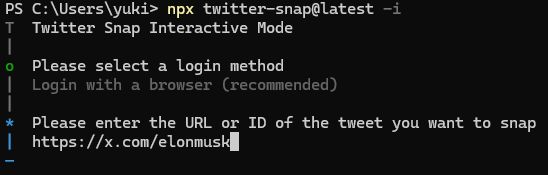

# twitter-snap

Create beautiful Tweet images fast.
Fast, good design, Browser is not a dependency.

```shell
npx twitter-snap@latest https://twitter.com/elonmusk/status/1770222178279252062
```

<p float="left">
  
   
  
  
</p>

[More Samples](https://github.com/fa0311/twitter-snap/issues/47)

```shell
# Interactive mode
npx twitter-snap@latest -i
```



```shell
# Output the API response directly to a file in raw JSON format.
npx twitter-snap@latest --theme Json https://x.com/elonmusk/status/1349129669258448897
# Download the media file and save it directly to a file in its raw format.
npx twitter-snap@latest --theme MediaOnly https://x.com/elonmusk/status/1349129669258448897
```

## Install

`npm -g i twitter-snap@latest`

## Docker

```shell
docker run -it --rm -v $(pwd)/output:/app/output ghcr.io/fa0311/twitter-snap/twitter-snap-docker:latest https://x.com/elonmusk/status/1349129669258448897
```

```shell
docker run -it --rm -v $(pwd)/output:/app/output -v $(pwd)/cookies.json:/app/cookies.json twitter-snap https://x.com/elonmusk/status/1349129669258448897 --session-type file
```

`--session-type=browser` is not supported

# Use as a package

```shell
npm i twitter-snap
```

```typescript
import {TwitterSnap} from 'twitter-snap'

const [client, api] = await twitterSnapGuest() // or twitterSnapCookies or twitterSnapPuppeteer
const fonts = await getFonts('.cache/fonts')
await client({id: id, limit: 1, type: 'getTweetDetail', startId: id}, async (render) => {
  const finalize = await render({
    output: `temp/${id}.{if-photo:png:mp4}`,
    themeName: 'RenderOceanBlueColor',
    themeParam: {
      fonts: fonts,
      width: 1440,
    },
  })
  await finalize({cleanup: true})
})
```

Also, if you use advanced customization, please use [twitter-snap-core](https://github.com/fa0311/twitter-snap-core).

## Arguments

```shell
$ twitter-snap --help
Create beautiful Tweet images fast

USAGE
  $ twitter-snap  ID [--api
    getTweetResultByRestId|getTweetDetail|getSearchTimeline|getHomeTimeline|getHomeLatestTimeline|getListLatestTweetsTim
    eline|getUserTweets|getUserTweetsAndReplies|getUserMedia|getLikes|getBookmarks] [--browserHeadless]
    [--browserProfile <value>] [--cookiesFile <value>] [--debug] [--interactive] [--ffmpegAdditonalOption <value>]
    [--ffmpegPath <value>] [--ffprobePath <value>] [--fontPath <value>] [--limit <value>] [--noCleanup] [-o <value>]
    [--sessionType <value>] [--simpleLog] [--sleep <value>] [--theme
    RenderOceanBlueColor|RenderOceanBlueDarkColor|RenderSunsetGardenColor|RenderSunsetGardenDarkColor|RenderDawnBlossomC
    olor|RenderDawnBlossomDarkColor|RenderFierySunsetColor|RenderFierySunsetDarkColor|RenderTwilightSkyColor|RenderTwili
    ghtSkyDarkColor|RenderPlainColor|RenderPlainDarkColor|RenderTransparent|RenderTransparentDark|RenderTransparentShado
    w|RenderTransparentDarkShadow|RenderMakeItAQuote|MediaOnly|Json] [--width <value>] [--scale <value>]

ARGUMENTS
  ID  Twitter status id

FLAGS
  -o, --output=<value>
      [default: {if-media-only:{id}-{media-id}:{id}}.{if-photo:png:mp4}] Output file name

  --api=<option>
      [default: getTweetResultByRestId] API type
      <options: getTweetResultByRestId|getTweetDetail|getSearchTimeline|getHomeTimeline|getHomeLatestTimeline|getListLates
      tTweetsTimeline|getUserTweets|getUserTweetsAndReplies|getUserMedia|getLikes|getBookmarks>

  --browserHeadless
      Browser headless

  --browserProfile=<value>
      [default: ~/.cache/twitter-snap/profiles] Browser profile

  --cookiesFile=<value>
      [default: cookies.json] Cookies file

  --debug
      Debug

  --ffmpegAdditonalOption=<value>
      FFmpeg additonal option

  --ffmpegPath=<value>
      [default: ffmpeg] FFmpeg path

  --ffprobePath=<value>
      [default: ffprobe] FFprobe path

  --fontPath=<value>
      [default: ~/.cache/twitter-snap/fonts] Font path

  --interactive
      Enable interactive mode

  --limit=<value>
      [default: 30] Limit count

  --noCleanup
      Cleanup

  --scale=<value>
      [default: 1] Scale

  --sessionType=<value>
      [default: guest] Session type

  --simpleLog
      Simple log

  --sleep=<value>
      Sleep (ms)

  --theme=<option>
      [default: RenderOceanBlueColor] Theme type
      <options: RenderOceanBlueColor|RenderOceanBlueDarkColor|RenderSunsetGardenColor|RenderSunsetGardenDarkColor|RenderDa
      wnBlossomColor|RenderDawnBlossomDarkColor|RenderFierySunsetColor|RenderFierySunsetDarkColor|RenderTwilightSkyColor|R
      enderTwilightSkyDarkColor|RenderPlainColor|RenderPlainDarkColor|RenderTransparent|RenderTransparentDark|RenderTransp
      arentShadow|RenderTransparentDarkShadow|RenderMakeItAQuote|MediaOnly|Json>

  --width=<value>
      [default: 650] Width

DESCRIPTION
  Create beautiful Tweet images fast
  https://github.com/fa0311/twitter-snap

EXAMPLES
  Create a snap from tweet id with minimal commands.

    $ twitter-snap https://twitter.com/elonmusk/status/1349129669258448897

  Enable interactive mode.

    $ twitter-snap --interactive

```

## Dependence

- [ffmpeg](https://ffmpeg.org/) (for video)
