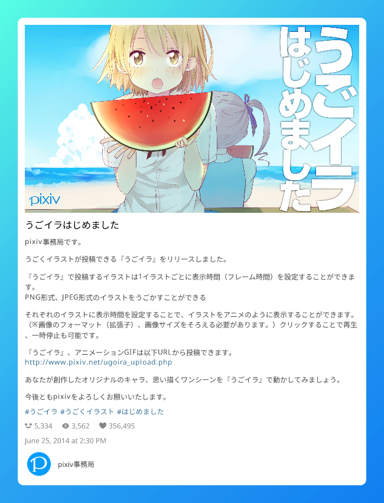

# twitter-snap

Create beautiful Tweet images fast.
Fast, good design, Browser is not a dependency.

```shell
npx twitter-snap@latest https://twitter.com/elonmusk/status/1770222178279252062
```

<p float="left">
  
  
  
  
</p>

<p float="left">
  
</p>

[More Samples](https://github.com/fa0311/twitter-snap/issues/47)

```shell
# Interactive mode
npx twitter-snap@latest -i
```


---

```shell
# Login with cookies
npx twitter-snap@latest https://twitter.com/elonmusk/status/1349129669258448897 --session-type file --cookies-file cookies.json
# Login with puppeteer
npx twitter-snap@latest https://twitter.com/elonmusk/status/1349129669258448897 --session-type browser

# Output the API response directly to a file in raw JSON format.
npx twitter-snap@latest --theme Json https://x.com/elonmusk/status/1349129669258448897 -o output/data.json
# Download the media file and save it directly to a file in its raw format.
npx twitter-snap@latest --theme Media https://x.com/elonmusk/status/1349129669258448897 -o output/{count}
# Use chatgpt to summarize the data in this tweet.
npx twitter-snap@latest --theme LiteJson -o {stdout} https://x.com/elonmusk | chatgpt -p 'Summarize the data in this tweet.'
```

## Install

`npm -g i twitter-snap@latest`

## Docker

```shell
docker run -it --rm -v $(pwd)/output:/app/output ghcr.io/fa0311/twitter-snap/twitter-snap-docker:latest https://x.com/elonmusk/status/1349129669258448897
```

```shell
docker run -it --rm -v $(pwd)/output:/app/output -v $(pwd)/cookies.json:/app/cookies.json ghcr.io/fa0311/twitter-snap/twitter-snap-docker:latest https://x.com/elonmusk/status/1349129669258448897 --session-type file
```

`--session-type=browser` is not supported.

`GPU` is not supported.

# Use as a package

```shell
npm i twitter-snap
```

```typescript
import {getSnapAppRender} from 'twitter-snap'

const snap = getSnapAppRender({url: 'https://x.com/elonmusk/status/1349129669258448897'})
const font = await snap.getFont()
const session = await snap.login({sessionType: 'guest'})
const render = await snap.getRender({limit: 1, session})

await snap.run(render, async (run) => {
  const res = await run({
    width: 650,
    theme: 'RenderOceanBlueColor',
    font,
    output: 'temp/{id}-{count}.{if-type:png:mp4:json:}',
  })
  await res.file.tempCleanup()
})
```

```typescript
import {getSnapAppRenderWithCache} from 'twitter-snap'

const snap = getSnapAppRenderWithCache({})
const res = await snap({
  url: 'https://x.com/elonmusk/status/1349129669258448897',
  callback: async (run) => {
    const res = await run({
      width: 1440,
      scale: 2,
      theme: 'RenderOceanBlueColor',
      output: 'temp/{id}-{count}.{if-type:png:mp4:json:}',
    })
    await res.file.tempCleanup()
  },
})
```

# Usage

<!-- COMMANDS_PLACEHOLDER_START -->

```shell
$ node bin/run.js --help
Create beautiful Tweet images fast

USAGE
  $ twitter-snap  URL [--browserHeadless] [--browserProfile
    <value>] [--cookiesFile <value>] [--debug] [--interactive]
    [--ffmpegAdditonalOption <value>] [--ffmpegTimeout <value>] [--ffmpegPath
    <value>] [--ffprobePath <value>] [--fontPath <value>] [--limit <value>]
    [--noCleanup] [-o <value>] [--sessionType browser|file|guest] [--simpleLog]
    [--sleep <value>] [--theme RenderOceanBlueColor|RenderOceanBlueDarkColor|Ren
    derSunsetGardenColor|RenderSunsetGardenDarkColor|RenderDawnBlossomColor|Rend
    erDawnBlossomDarkColor|RenderFierySunsetColor|RenderFierySunsetDarkColor|Ren
    derTwilightSkyColor|RenderTwilightSkyDarkColor|RenderPlainColor|RenderPlainD
    arkColor|RenderTransparent|RenderTransparentDark|RenderTransparentShadow|Ren
    derTransparentShadowDark|Json|LiteJson|Media|RenderMakeItAQuote] [--width
    <value>] [--scale <value>]

ARGUMENTS
  URL  Twitter url

FLAGS
  -o, --output=<value>
      [default: {id}-{count}.{if-type:png:mp4:json:}] Output file name

  --browserHeadless
      Browser headless

  --browserProfile=<value>
      [default: ~/.cache/twitter-snap/profiles] Browser profile

  --cookiesFile=<value>
      [default: cookies.json] Cookies file

  --debug
      Debug

  --ffmpegAdditonalOption=<value>
      FFmpeg additonal option

  --ffmpegPath=<value>
      [default: ffmpeg] FFmpeg path

  --ffmpegTimeout=<value>
      [default: -1] FFmpeg timeout

  --ffprobePath=<value>
      [default: ffprobe] FFprobe path

  --fontPath=<value>
      [default: ~/.cache/twitter-snap/fonts] Font path

  --interactive
      Enable interactive mode

  --limit=<value>
      [default: 20] Limit count

  --noCleanup
      Cleanup

  --scale=<value>
      [default: 1] Scale

  --sessionType=<option>
      [default: guest] Session type
      <options: browser|file|guest>

  --simpleLog
      Simple log

  --sleep=<value>
      Sleep (ms)

  --theme=<option>
      [default: RenderOceanBlueColor] Theme type
      <options: RenderOceanBlueColor|RenderOceanBlueDarkColor|RenderSunsetGardenCo
      lor|RenderSunsetGardenDarkColor|RenderDawnBlossomColor|RenderDawnBlossomDark
      Color|RenderFierySunsetColor|RenderFierySunsetDarkColor|RenderTwilightSkyCol
      or|RenderTwilightSkyDarkColor|RenderPlainColor|RenderPlainDarkColor|RenderTr
      ansparent|RenderTransparentDark|RenderTransparentShadow|RenderTransparentSha
      dowDark|Json|LiteJson|Media|RenderMakeItAQuote>

  --width=<value>
      [default: 650] Width

DESCRIPTION
  Create beautiful Tweet images fast
  https://github.com/fa0311/twitter-snap

EXAMPLES
  Create a snap from tweet id with minimal commands.

    $ twitter-snap https://twitter.com/elonmusk/status/1349129669258448897

  Enable interactive mode.

    $ twitter-snap --interactive


```

<!-- COMMANDS_PLACEHOLDER_END -->

# Features

- `https?://(www.)?(mobile.)?(x|twitter).com`

  - `/:user/status/:id`
  - `/search?:params`
  - `/home`
  - `/i/lists/:id`
  - `/:user/with_replies`
  - `/:user/media`
  - `/:user/likes`
  - `/:user`
  - `/i/bookmarks`

- `https?://(www.)?pixiv.net`
  - `/artworks/:id`

## Dependence

- [ffmpeg](https://ffmpeg.org/) (for video)
